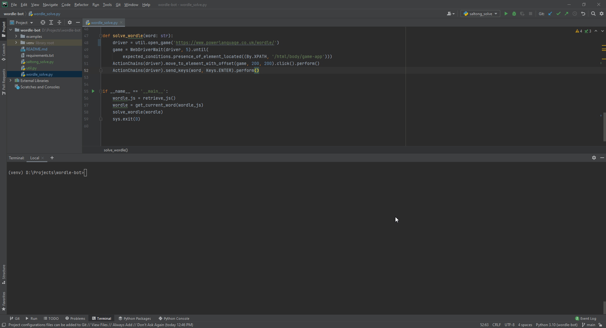
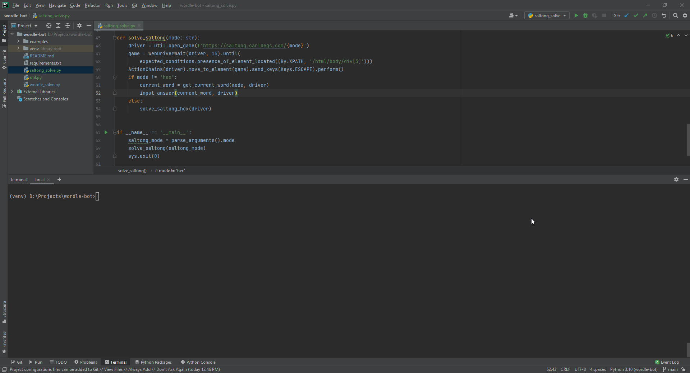
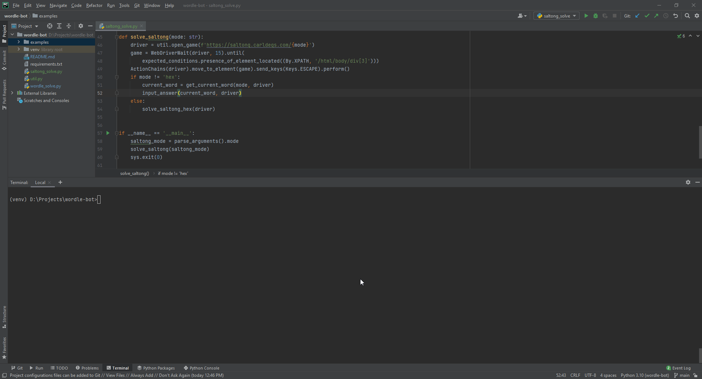

# Wordle Bot
A bot that solves [Wordle](https://www.powerlanguage.co.uk/wordle/).

## Pre-requisites
1. Download and install [Python3](https://www.python.org/downloads/).
2. Install required pip packages using the command `pip install -r requirements.txt`.

## Usage

### Wordle
Command: `python wordle_solve.py`

### Saltong
Command:
- `python saltong_solve.py`
- `python saltong_solve.py -m main`
- `python saltong_solve.py --mode=main`

### Saltong Mini
Command:
- `python saltong_solve.py -m mini`
- `python saltong_solve.py --mode=mini`

### Saltong Max
Command:
- `python saltong_solve.py -m max`
- `python saltong_solve.py --mode=max`

### Saltong Hex
Command:
- `python saltong_solve.py -m hex`
- `python saltong_solve.py --mode=hex`

