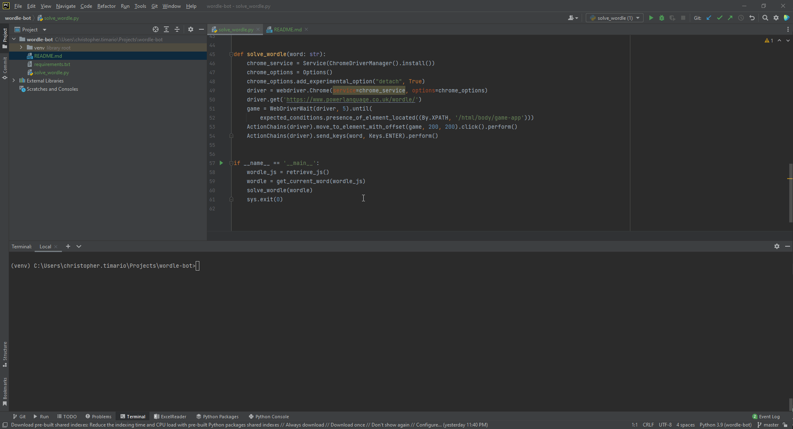

# Wordle Bot
A bot that solves [Wordle](https://www.powerlanguage.co.uk/wordle/).

## Pre-requisites
1. Download and install [Python3](https://www.python.org/downloads/).
2. Install required pip packages using the command `pip install -r requirements.txt`.

## Usage
Execute script using the command `python solve_wordle.py`

